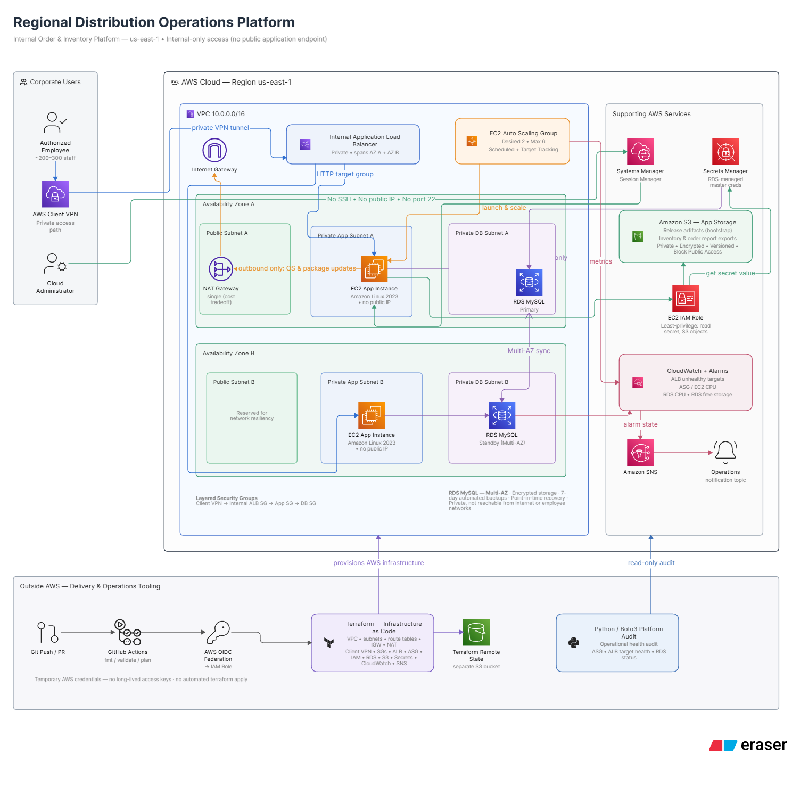

# 🚚 Regional Distribution Operations Platform

**Status:** Completed

**Environment status:** The AWS infrastructure was fully deployed, validated, and tested during development, then intentionally destroyed after project completion to prevent ongoing cloud costs. The repository preserves the Terraform, application code, automation, runbooks, and CI/CD configuration required to document and reproduce the environment.

**Focus:** AWS • Terraform • Linux • Networking • Cloud Operations • CI/CD • Monitoring • Troubleshooting

A hands-on cloud engineering portfolio project that simulates the AWS infrastructure behind a regional distribution company's internal order and inventory platform. The application itself is intentionally lightweight — the real focus is the infrastructure and operations work around it.

Additional diagrams (network layout, scaling flow, security-group flow, alerting flow, CI/CD flow) live in [`docs/architecture.md`](docs/architecture.md).

---

## 🏢 The Business Problem

A regional distribution company operates several warehouses and distribution facilities in Georgia. Roughly 200–300 employees use an internal web application throughout the workday for inventory lookup, order processing, shipment-status tracking, warehouse operations, and basic internal reporting — with heavier demand during month-end processing, busy fulfillment periods, and seasonal spikes.

The company wanted to migrate this system into AWS while improving reliability, security, scalability, visibility, and recoverability. The application is internal-only and should never be directly reachable from the public internet — remote employees connect through AWS Client VPN. The first design targets a single AWS Region across two Availability Zones.

---

## 🏗️ Architecture

Supporting services: Terraform, IAM, Systems Manager, CloudWatch, SNS, S3, Secrets Manager, NAT Gateway, Internet Gateway, GitHub Actions.

---

## 🧠 Key Decisions & Why

### Access & Networking
- **Client VPN instead of public exposure.** The app serves internal employees only — there's no business reason to expose it to the internet, so VPN + private subnets removes an entire attack surface up front.
- **Two AZs, six subnets (public / app / db per AZ).** Enough for real multi-AZ failover practice without the cost and complexity of a third AZ, which wasn't necessary at this scale.
- **Single NAT Gateway.** A deliberate cost tradeoff — outbound-only traffic (patching, dependencies) doesn't need per-AZ redundancy at this stage. Documented as a known resilience gap rather than an oversight.

### Compute & Scaling
- **EC2 in an Auto Scaling Group, not a single instance.** Private, no public IPs, spans both AZs — gives real hands-on ASG and Linux-operations practice (systemd, bootstrap, log investigation) instead of a single static box.
- **Scheduled + dynamic scaling together.** Scheduled scaling covers known weekday demand; dynamic scaling (60% CPU target-tracking) covers unpredictable spikes. Using only one wouldn't reflect a realistic production traffic pattern.

### Data Layer
- **RDS Multi-AZ MySQL.** The workload's relational data (customers, orders, inventory, shipments) has genuine referential structure; Multi-AZ gives automatic failover without hand-rolling replication.
- **Secrets Manager for DB credentials.** RDS-managed credential rotation means the application never touches a hardcoded credential in source code, Terraform, or EC2 config.

### Security
- **Systems Manager Session Manager instead of SSH.** No key pairs, no port 22, no inbound management rule at all — removes a classic lateral-movement vector entirely.
- **Layered security groups** (Client VPN → ALB → App → DB). Each tier only accepts traffic from the tier directly in front of it; the database only ever talks to the application layer.

### CI/CD
- **GitHub Actions with AWS OIDC.** Temporary, scoped credentials for `plan`/`validate` instead of long-lived AWS access keys stored as GitHub secrets. `apply` is intentionally not automated yet — plan output gets a manual review while trust in the pipeline builds.

---

## 🚀 What I'd Do Differently at Production Scale

- **One NAT Gateway per AZ** instead of a single shared one — closes the resilience gap accepted here for cost savings.
- **Three Availability Zones** instead of two, for a higher blast-radius tolerance.
- **RDS read replica(s)** to offload reporting queries from the primary, especially given the "basic internal reporting" requirement.
- **WAF in front of the ALB**, even though it's internal-only — defense in depth against a compromised VPN credential.
- **Automated `terraform apply`** behind a manual approval gate, rather than a plan-only pipeline.
- **Centralized logging** (CloudWatch Logs → a proper aggregation/SIEM tool) instead of per-service log groups, once there's more than one workload to correlate across.
- **Multi-region DR**, if the business risk of a full regional outage justified the added cost and complexity.